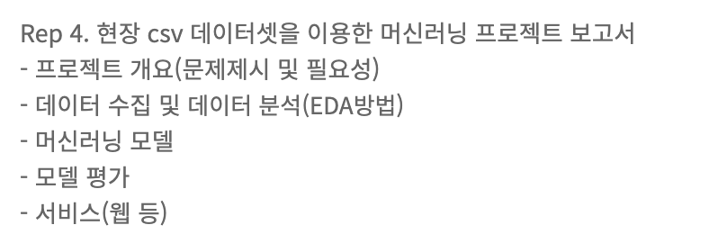

# ML_sprint
머신 러닝 입문 1주일안에 만드는 스프린트 과제

## 1. 주제
**대학교 내부에 존재하는 체육관의 현재 인원수를 예측하는 모델**

## 2. 데이터
[kaggle : Crowdedness at the Campus Gym](https://www.kaggle.com/datasets/nsrose7224/crowdedness-at-the-campus-gym)

## 3. 과정

[- 주제 선정 및 데이터 전처리](https://github.com/Pinkippo/ML_sprint/commit/de89006019b7e8c811dcf68cc17cc22d75a48023) 

[- 머신러닝 모델 학습](https://github.com/Pinkippo/ML_sprint/commit/97789e06cc481dd726f616b01eaa869ce1708ed6)

[- 플라스크 서버 구축](https://github.com/Pinkippo/ML_sprint/commit/4a2354518dcdd4a732f66a0c63d7488238d05cab)
